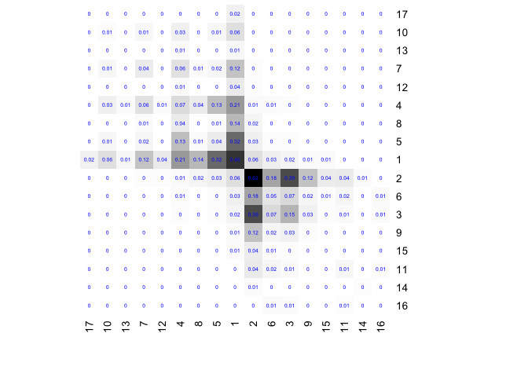

<!-- README.md is generated from README.Rmd. Please edit that file -->

# nethist

<!-- badges: start -->

[](https://github.com/EnigmaSong/nethist/actions/workflows/R-CMD-check.yaml)
[](https://lifecycle.r-lib.org/articles/stages.html#experimental)
<!-- badges: end -->

The goal of *nethist* is to estimate graphons by *network histogram*
(Wolfe and Olhede 2013; Olhede and Wolfe 2014). It also provides extra
tools for summary violin plot for networks (Maugis, Olhede, and Wolfe
2017) and visualizing network histogram. Use undirected and simple
graphs with no self-loops (either igraph or matrix) as inputs for the
functions in this package.

To install the package from source, you need C++ and Fortran compilers.

## Installation

You can install the development version of nethist from
[GitHub](https://github.com/) with:

``` r
# install.packages("devtools")
devtools::install_github("EnigmaSong/nethist")
```

## Example

Here are basic examples using political blog data set in the package:

### Network histogram

``` r
library(nethist)
```

We use *polblog* dataset in the package for our examples.


We can estimate a network histogram from the political blog data and
plot it.

``` r
## Example code using polblog data set
set.seed(42)
hist_polblog <- nethist(polblog, h = 72) #using user-specified bin size.
plot(hist_polblog)
```


### Plotting option

#### heatmap() style

`plot()` provides 2D plot as `heatmap()`.

You can use a user-specified indices for plots. Here is an example:

``` r
print(ind) 
#>  [1] 17 10 13  7 12  4  8  5  1  2  6  3  9 15 11 14 16
## Users can specify the index order of heatmap
plot(hist_polblog, idx_order = ind)
```


``` r

## Users can specify the color palette
library(RColorBrewer)
plot(hist_polblog,  idx_order = ind, col = brewer.pal(9, "Greys"))
```


You can display the estimated block probabilities by setting
`type = prob` and `prob=TRUE`.

``` r
## Users can specify the color palette 
plot(hist_polblog, idx_order = ind, type = "prob", prob= TRUE, prob.col = "blue",
     col = colorRampPalette(colors=c("#FFFFFF","#000000"))(200))
```



### others

There are more types of plots in `nethist` package.

### Summary violin plot

If you want to check network summary violin plot of the data set:

``` r
#User-specified subsample size.
violin_netsummary(polblog, max_cycle_order = 7, subsample_sizes = 250) 
#> Use R= 697
```


``` r
#Auto-selected subsample size.
violin_netsummary(polblog, max_cycle_order = 7) 
#> Use R= 697
```


## Reference

<div id="refs" class="references csl-bib-body hanging-indent">

<div id="ref-maugis2017Topology" class="csl-entry">

Maugis, Pierre-André G., Sofia C. Olhede, and Patrick J. Wolfe. 2017.
“Topology Reveals Universal Features for Network Comparison.”
*arXiv:1705.05677*, May. <http://arxiv.org/abs/1705.05677>.

</div>

<div id="ref-olhede2014Network" class="csl-entry">

Olhede, Sofia C., and Patrick J. Wolfe. 2014. “Network Histograms and
Universality of Blockmodel Approximation.” *Proceedings of the National
Academy of Sciences* 111 (41): 14722–27.
<https://doi.org/10.1073/pnas.1400374111>.

</div>

<div id="ref-wolfe2013Nonparametric" class="csl-entry">

Wolfe, Patrick J., and Sofia C. Olhede. 2013. “Nonparametric Graphon
Estimation.” *arXiv:1309.5936*, September.
<http://arxiv.org/abs/1309.5936>.

</div>

</div>
