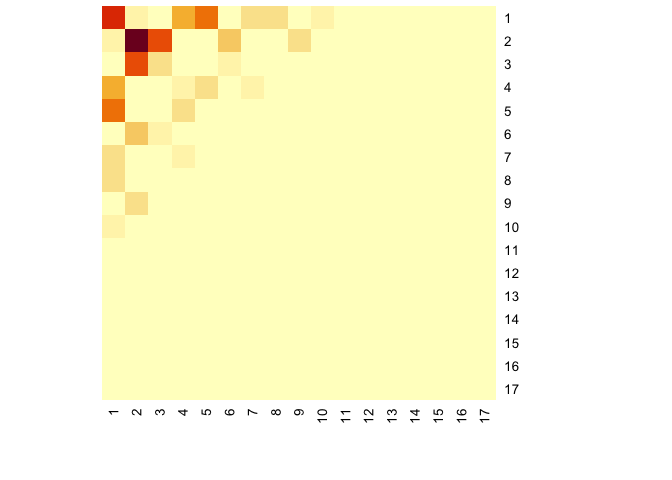

<!-- README.md is generated from README.Rmd. Please edit that file -->

# nethist

<!-- badges: start -->
<!-- badges: end -->

The goal of *nethist* is to estimate scaled graphons via *network
histogram*. It also provides extra tools for summary violon plot for
networks and visualizing network histogram.

## Installation

You can install the development version of nethist from
[GitHub](https://github.com/) with:

``` r
# install.packages("devtools")
devtools::install_github("EnigmaSong/nethist")
```

## Example

This is a basic example using political blog data set in the package:

First, we estimate a network histogram from the political blog data and
plot it.

``` r
library(nethist)
## Example code using polblog data set
set.seed(42)
hist_polblog <- nethist(polblog, h = 72) #using user-specified bin size.
plot(hist_polblog)
```



You can use a user-specified indices order for plots. Here is an
example:

``` r
## Users can specify the index order of heatmap
plot(hist_polblog, idx_order = c(17,16,14,12,10,7,5,3,1,2,4,6,8,9,11,13,15))
```


If you want to check network summary violin plot of the data set:

``` r
violin_netsummary(polblog, max_cycle_order = 7, subsample_sizes = 250) #User-specified subsample size.
#> Use R= 697
```


``` r

violin_netsummary(polblog, max_cycle_order = 7) #Auto-selected subsample size.
#> Use R= 697
```


