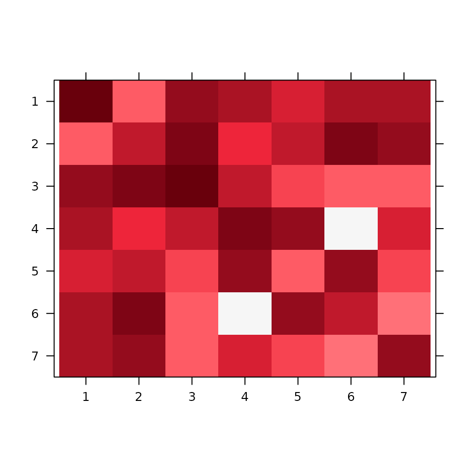
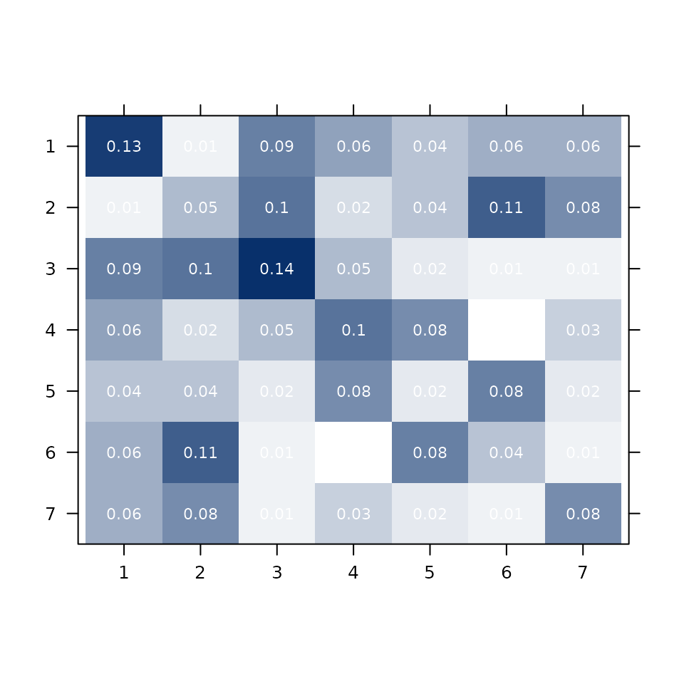
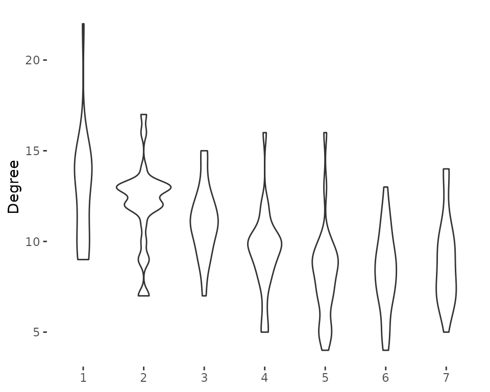
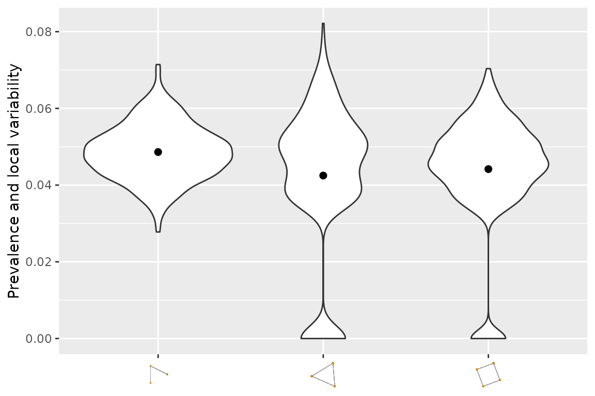

# Introduction to nethist

``` r

library(nethist)
#> Warning: no DISPLAY variable so Tk is not available
```

## Overview

The **nethist** package estimates *network histograms* for single-layer
and multiplex (multi-layer) networks. A network histogram partitions the
nodes of a network into groups (bins) such that the connectivity pattern
between groups approximates the underlying graphon — the generative
probability function of the network. This provides a non-parametric,
interpretable summary of large network structure.

The package implements the methods from:

- **Single-layer**: Olhede & Wolfe (2014). *Network Histograms and
  Universality of Blockmodel Approximation*. PNAS, 111(41).
- **Multi-layer**: Song & Olhede (2026+). *Graph Limits for Sparse
  Multilayer Networks*.

The package provides:

| Function | Description |
|----|----|
| [`nethist()`](https://enigmasong.github.io/nethist/reference/nethist.md) | Network histogram for a single-layer network |
| [`multinethist()`](https://enigmasong.github.io/nethist/reference/multinethist.md) | Network histogram for a multiplex network |
| [`plot()`](https://rdrr.io/r/graphics/plot.default.html) | Heatmap of the estimated histogram |
| [`plot3d()`](https://enigmasong.github.io/nethist/reference/plot3d.md) | 3D histogram plot for multiplex networks |
| [`summary_plot()`](https://enigmasong.github.io/nethist/reference/covariate_plot.md) | Covariate distribution by estimated bin |
| [`violin_netsummary()`](https://enigmasong.github.io/nethist/reference/netsummary_plot.md) | Topology summary via subgraph prevalence |

------------------------------------------------------------------------

## Single-Layer Network Histogram

### Estimating the histogram

[`nethist()`](https://enigmasong.github.io/nethist/reference/nethist.md)
accepts an adjacency matrix, a sparse `dgCMatrix`, or an `igraph`
object. The bandwidth parameter `h` (number of bins) is selected
automatically if not specified.

``` r

set.seed(42)
data(polblog)

# Automatic bandwidth selection
nethist_polblog <- nethist(polblog)
print(nethist_polblog)
```

The result is a `nethist` object with the following components:

- `cluster`: a vector assigning each node to a bin (integer labels 1 to
  k)
- `thetahat`: a k × k matrix of estimated connection probabilities
  between bins
- `rho_hat`: estimated overall network density
- `normalized_LL`: normalized profile log-likelihood at the solution

For a quick example with a synthetic network:

``` r

set.seed(2024)
A_gnp <- igraph::sample_gnp(200, 0.05)
result <- nethist(A_gnp)
print(result)
#> 
#> thetahat:
#>            [,1]       [,2]       [,3]       [,4]       [,5]       [,6]
#> [1,] 0.13230769 0.01331361 0.08875740 0.06213018 0.04142012 0.05621302
#> [2,] 0.01331361 0.04923077 0.09615385 0.02366864 0.04289941 0.10798817
#> [3,] 0.08875740 0.09615385 0.14461538 0.04733728 0.01775148 0.01479290
#> [4,] 0.06213018 0.02366864 0.04733728 0.09846154 0.07840237 0.00000000
#> [5,] 0.04142012 0.04289941 0.01775148 0.07840237 0.01538462 0.08431953
#> [6,] 0.05621302 0.10798817 0.01479290 0.00000000 0.08431953 0.04307692
#> [7,] 0.05856643 0.07867133 0.01398601 0.03234266 0.02010490 0.01048951
#>            [,7]
#> [1,] 0.05856643
#> [2,] 0.07867133
#> [3,] 0.01398601
#> [4,] 0.03234266
#> [5,] 0.02010490
#> [6,] 0.01048951
#> [7,] 0.07928118
#> 
#> Method: Profile Likelihood
#> 
#> normalized likelihood:
#> -3.70248405576056
#> 
#> Available components:
#> 
#> [1] "cluster"       "thetahat"      "rho_hat"       "normalized_LL"
#> [5] "MSE"           "method"        "h"
```

### Visualising the histogram

[`plot()`](https://rdrr.io/r/graphics/plot.default.html) draws a heatmap
of the estimated connection probabilities. Bins are shown in the order
of their label by default; you can supply a custom permutation via
`idx_order`.

``` r

plot(result)
```



To display the estimated probability values on each bin:

``` r

plot(result, type = "prob", prob = TRUE,
     col.regions = colorRampPalette(c("#FFFFFF", "#08306B"))(50))
```



------------------------------------------------------------------------

## Multiplex Network Histogram

A *multiplex network* is a collection of networks defined on the same
node set, each representing a different type of relationship (layer).

### Estimating the histogram

[`multinethist()`](https://enigmasong.github.io/nethist/reference/multinethist.md)
accepts a three-dimensional adjacency array of size n × n × L, where L
is the number of layers, or a list of `igraph` objects.

``` r

set.seed(42)
data(IndianVil)

# IndianVil is a 231 x 231 x 12 adjacency array
# representing 12 socioeconomic relationship types in an Indian village
mnethist_result <- multinethist(IndianVil)
print(mnethist_result)
```

The `common_f` argument controls whether a common histogram function is
assumed across layers:

``` r

# Heterogeneous histogram (default): each layer has its own density
mnethist_het <- multinethist(IndianVil, common_f = FALSE)

# Homogeneous histogram: shared structure, layer-specific density
mnethist_hom <- multinethist(IndianVil, common_f = TRUE)
```

For a fast illustrative example using synthetic data:

``` r

set.seed(2024)
# Build a small 2-layer network
A1 <- igraph::as_adjacency_matrix(igraph::sample_gnp(80, 0.10), sparse = FALSE)
A2 <- igraph::as_adjacency_matrix(igraph::sample_gnp(80, 0.05), sparse = FALSE)
A_multi <- array(c(A1, A2), dim = c(80, 80, 2))

mn_result <- multinethist(A_multi)
print(mn_result)
#> 
#> Theta_hat:
#> , , 1
#> 
#>            [,1]       [,2]       [,3]       [,4]       [,5]
#> [1,] 0.15384615 0.15816327 0.03571429 0.14285714 0.14880952
#> [2,] 0.15816327 0.15384615 0.16836735 0.03571429 0.09226190
#> [3,] 0.03571429 0.16836735 0.03296703 0.12755102 0.10119048
#> [4,] 0.14285714 0.03571429 0.12755102 0.00000000 0.12202381
#> [5,] 0.14880952 0.09226190 0.10119048 0.12202381 0.01811594
#> 
#> , , 2
#> 
#>             [,1]        [,2]       [,3]        [,4]        [,5]
#> [1,] 0.021978022 0.122448980 0.08163265 0.025510204 0.005952381
#> [2,] 0.122448980 0.109890110 0.00000000 0.005102041 0.029761905
#> [3,] 0.081632653 0.000000000 0.02197802 0.056122449 0.077380952
#> [4,] 0.025510204 0.005102041 0.05612245 0.098901099 0.065476190
#> [5,] 0.005952381 0.029761905 0.07738095 0.065476190 0.050724638
#> 
#> 
#> Method: Profile Likelihood
#> 
#> normalized likelihood:
#> -3.25258572523459
#> 
#> Available components:
#> 
#> [1] "cluster"       "thetahat"      "rho_hat"       "normalized_LL"
#> [5] "MSE"           "method"        "homogeneous"   "h"
```

### 2D heatmap

``` r

plot(mn_result)
```


### 3D histogram

For multiplex networks,
[`plot3d()`](https://enigmasong.github.io/nethist/reference/plot3d.md)
displays a three-dimensional bar chart of `thetahat` across layers.

``` r

plot3d(mnethist_result)
```

------------------------------------------------------------------------

## Covariate Summary by Bin

Once nodes are assigned to bins, it is often informative to examine how
an external covariate is distributed across bins.
[`summary_plot()`](https://enigmasong.github.io/nethist/reference/covariate_plot.md)
produces:

- a **stacked bar chart** for a `factor` covariate
- a **violin plot** for a `numeric` covariate

### Factor covariate (political affiliation)

The `polblog` network is a hyperlink network among US political blogs.
Nodes are labelled as Liberal or Conservative.

``` r

set.seed(42)
data(polblog)
nethist_polblog <- nethist(polblog)

political_label <- factor(
  c(rep("Liberal", 586), rep("Conservative", 638))
)

summary_plot(nethist_polblog, covariate = political_label,
             legend_title = "Political affiliation")
```

The bins with high within-group homogeneity will appear nearly solid in
one colour, suggesting that the network histogram has recovered
politically coherent communities.

### Numeric covariate

``` r

set.seed(2024)
A_gnp <- igraph::sample_gnp(200, 0.05)
result <- nethist(A_gnp)

# Node degree as a numeric covariate
node_degree <- igraph::degree(A_gnp)
summary_plot(result, covariate = node_degree, ylab = "Degree")
#> Warning in summary_plot(result, covariate = node_degree, ylab = "Degree"): 'summary_plot' is deprecated.
#> Use 'covariate_plot' instead.
#> See help("Deprecated")
```



------------------------------------------------------------------------

## Network Topology Summary

[`violin_netsummary()`](https://enigmasong.github.io/nethist/reference/netsummary_plot.md)
implements the network summary statistic of Maugis et al. (2017). It
estimates the prevalence of small subgraph patterns (v-shapes,
triangles, squares, …) via vertex subsampling, and draws a violin plot.

This is useful for comparing the topology of an estimated histogram
against the original network, or for comparing networks from different
studies.

``` r

set.seed(2024)
A_gnp <- igraph::sample_gnp(400, 0.05)
violin_netsummary(A_gnp)
#> Warning in violin_netsummary(A_gnp): 'violin_netsummary' is deprecated.
#> Use 'netsummary_plot' instead.
#> See help("Deprecated")
#> Use n_rep = 574
```



The y-axis shows the prevalence (proportion of sampled subgraphs of that
type), and the width of each violin reflects variability across
subsamples. A roughly flat distribution indicates an Erdős–Rényi-like
structure; peaked distributions suggest community or
degree-heterogeneous structure.

------------------------------------------------------------------------

## Supported Input Types

All main functions accept three input formats:

| Format | Class | Example |
|----|----|----|
| Dense adjacency matrix | `matrix` | `igraph::as_adjacency_matrix(g, sparse = FALSE)` |
| Sparse adjacency matrix | `dgCMatrix` | `igraph::as_adjacency_matrix(g)` |
| igraph object | `igraph` | `igraph::sample_gnp(200, 0.05)` |

For
[`multinethist()`](https://enigmasong.github.io/nethist/reference/multinethist.md),
the input can also be a 3D `array` of size n × n × L.

------------------------------------------------------------------------

## References

Banerjee, A., Chandrasekhar, A. G., Duflo, E., & Jackson, M. O. (2013).
The diffusion of microfinance. *Science*, 341(6144), 1236498.

Gao, C., Lu, Y., & Zhou, H. H. (2015). Rate-optimal graphon estimation.
*The Annals of Statistics*, 43(6), 2624–2652.

Maugis, P.-A. G., Priebe, C. E., Olhede, S. C., & Wolfe, P. J. (2017).
Topology reveals universal features for network comparison.
*arXiv:1705.05677*.

Olhede, S. C. & Wolfe, P. J. (2014). Network histograms and universality
of blockmodel approximation. *Proceedings of the National Academy of
Sciences*, 111(41), 14722–14727.

Song, Y. & Olhede, S. C. (2026). Joint Estimation of Sparse Multilayer
Networks via Graph Limits. *arXiv:2608.14536*.
