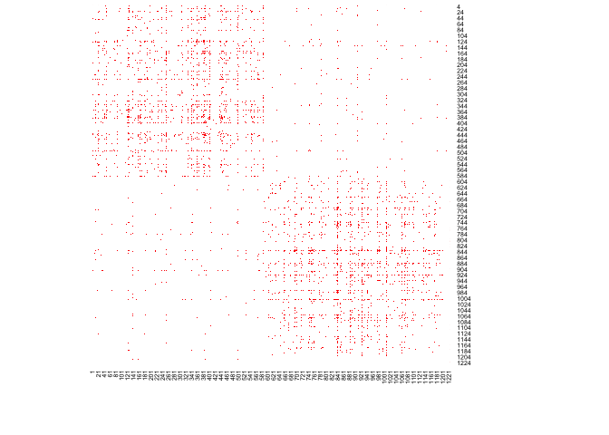
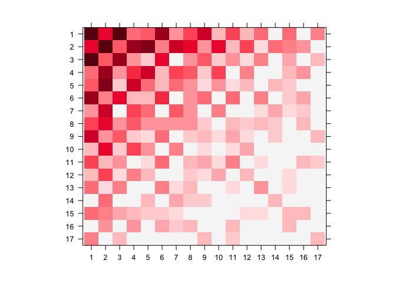
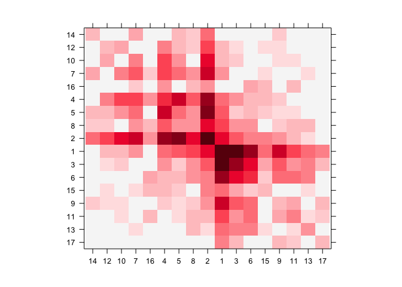
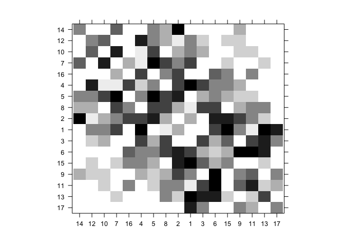
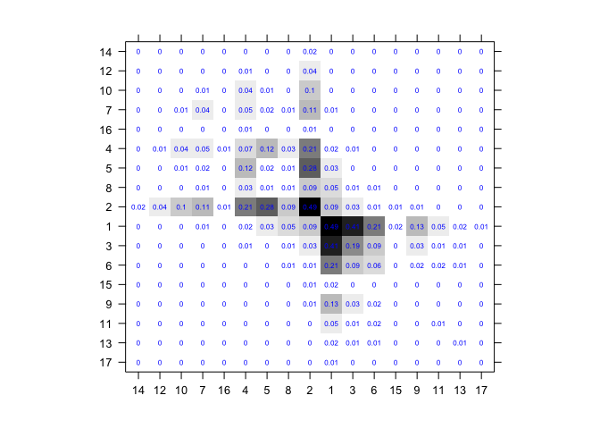
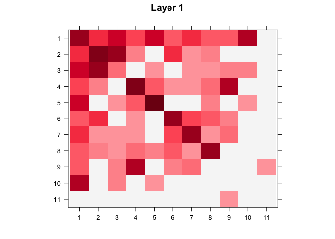
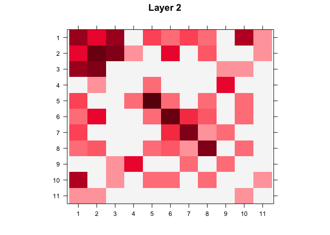
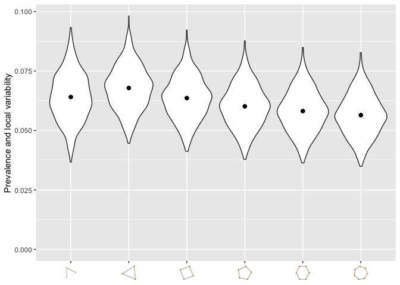
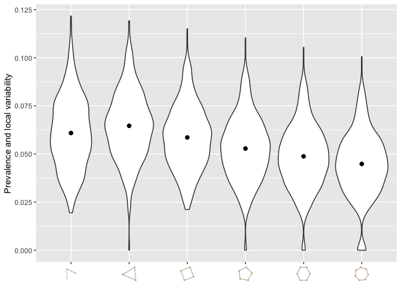

# nethist

**nethist** estimates network histograms, a blockmodel approximation to
the graphon (Wolfe and Olhede 2013) underlying a network’s connectivity
pattern, for single-layer and multilayer networks. It implements the
profile-likelihood method of Olhede and Wolfe (2014) and the
least-squares method of Gao et al. (2015) for single-layer networks, as
well as the multilayer extension of Song and Olhede (2026). The package
also provides tools for bandwidth selection, diagnostic plots, and
covariate visualization. Its functions accept undirected simple graphs
without self-loops as either `igraph` objects or adjacency matrices.

## Installation

You can install the development version of nethist from
[GitHub](https://github.com/) with:

``` r

# install.packages("devtools")
devtools::install_github("EnigmaSong/nethist")
```

## Example

Here are basic examples using political blog data set in the package:

### Network histogram

``` r

library(nethist)
```

We use *polblog* dataset in the package for our examples.



We can estimate a network histogram from the political blog data and
plot it.

``` r

## Example code using polblog data set
set.seed(42)
hist_polblog <- nethist(polblog, h = 72) #using user-specified bin size.
plot(hist_polblog)
```



### Plotting option

#### heatmap() style

[`plot()`](https://rdrr.io/r/graphics/plot.default.html) provides 2D
plot as [`heatmap()`](https://rdrr.io/r/stats/heatmap.html).

You can use a user-specified indices for plots. Here is an example:

``` r

print(ind) 
#>  [1] 14 12 10  7 16  4  5  8  2  1  3  6 15  9 11 13 17
## Users can specify the index order of heatmap
plot(hist_polblog, idx_order = ind)
```



``` r


## Users can specify the color palette
library(RColorBrewer)
plot(hist_polblog,  idx_order = ind, col.regions = brewer.pal(9, "Greys"))
```



You can display the estimated block probabilities by setting
`type = prob` and `prob=TRUE`.

``` r

## Users can specify the color palette 
plot(hist_polblog, idx_order = ind, type = "prob", prob= TRUE, prob.col = "blue",
     col.regions = colorRampPalette(colors=c("#FFFFFF","#000000"))(200))
```



### others

There are more types of plots in `nethist` package.

### Multilayer network histogram

[`multinethist()`](https://enigmasong.github.io/nethist/reference/multinethist.md)
extends the same estimation to multilayer networks. Here we use the
first two layers of the *IndianVil* dataset, a socio-economic network
with 12 layers.

``` r

data(IndianVil)
set.seed(42)
hist_indianvil <- multinethist(IndianVil[, , 1:2], h = 20L)
plot(hist_indianvil)
```



[`fitted()`](https://rdrr.io/r/stats/fitted.values.html) extracts a
submatrix of the fitted graphon for one or more layers.

``` r

fitted(hist_indianvil, set1 = 1:10, set2 = 1:10, layer = 1)
#>           [,1]     [,2]     [,3]     [,4]      [,5]      [,6]      [,7]      [,8]
#>  [1,] 8.510526 5.053125 1.155000 0.144375  0.866250  0.866250  0.866250  0.866250
#>  [2,] 5.053125 0.000000 1.010625 0.577500  0.000000  0.000000  0.000000  0.000000
#>  [3,] 1.155000 1.010625 6.990789 1.732500  3.176250  3.176250  3.176250  3.176250
#>  [4,] 0.144375 0.577500 1.732500 6.686842  0.000000  0.000000  0.000000  0.000000
#>  [5,] 0.866250 0.000000 3.176250 0.000000 10.030263 10.030263 10.030263 10.030263
#>  [6,] 0.866250 0.000000 3.176250 0.000000 10.030263 10.030263 10.030263 10.030263
#>  [7,] 0.866250 0.000000 3.176250 0.000000 10.030263 10.030263 10.030263 10.030263
#>  [8,] 0.866250 0.000000 3.176250 0.000000 10.030263 10.030263 10.030263 10.030263
#>  [9,] 0.866250 0.000000 3.176250 0.000000 10.030263 10.030263 10.030263 10.030263
#> [10,] 0.000000 0.000000 4.331250 0.000000  0.144375  0.144375  0.144375  0.144375
#>            [,9]    [,10]
#>  [1,]  0.866250 0.000000
#>  [2,]  0.000000 0.000000
#>  [3,]  3.176250 4.331250
#>  [4,]  0.000000 0.000000
#>  [5,] 10.030263 0.144375
#>  [6,] 10.030263 0.144375
#>  [7,] 10.030263 0.144375
#>  [8,] 10.030263 0.144375
#>  [9,] 10.030263 0.144375
#> [10,]  0.144375 0.000000
```

### Network topology summary

If you want to check the network topology summary plot of the dataset
(Maugis et al. 2017):

``` r

#User-specified subsample size.
netsummary_plot(polblog, max_cycle_order = 7, subsample_sizes = 250)
#> Use n_rep = 697
```



``` r

#Auto-selected subsample size.
netsummary_plot(polblog, max_cycle_order = 7)
#> Use n_rep = 697
```



## Reference

Gao, Chao, Yu Lu, and Harrison H. Zhou. 2015. “Rate-Optimal Graphon
Estimation.” *The Annals of Statistics* 43 (6): 2624–52.
<https://doi.org/10.1214/15-AOS1354>.

Maugis, Pierre-André G., Sofia C. Olhede, and Patrick J. Wolfe. 2017.
“Topology Reveals Universal Features for Network Comparison.”
*arXiv:1705.05677*, May. <https://arxiv.org/abs/1705.05677>.

Olhede, Sofia C., and Patrick J. Wolfe. 2014. “Network Histograms and
Universality of Blockmodel Approximation.” *Proceedings of the National
Academy of Sciences* 111 (41): 14722–27.
<https://doi.org/10.1073/pnas.1400374111>.

Song, Youngseok, and Sofia C. Olhede. 2026. *Joint Estimation of Sparse
Multilayer Networks via Graph Limits*.
<https://arxiv.org/abs/2608.14536>.

Wolfe, Patrick J., and Sofia C. Olhede. 2013. “Nonparametric Graphon
Estimation.” *arXiv:1309.5936*, September.
<https://arxiv.org/abs/1309.5936>.
